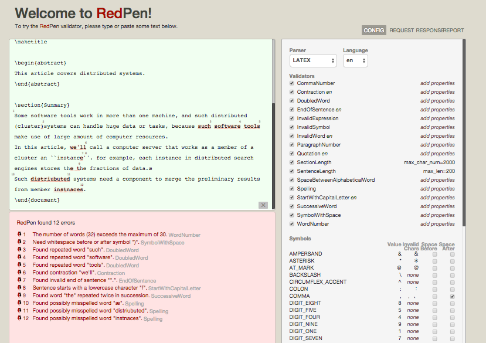
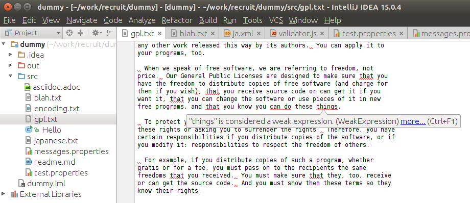

Overview
=========

RedPen is a proofreading tool to help writers or programmers who write technical documents or manuals that need to adhere to a writing standard. RedPen automates the verifications of input documents written in natural languages

   

See the detail usage in the RedPen [home page](https://redpen.cc/).

Features
=========

- Language independent
- Highly customizable
- Multi platform (MacOS, Windows, and Linux)
- Support various markup text formats (Wiki, Markdown, AsciiDoc, LaTeX, Re:VIEW, reStructuredText)
- [Plugin system: users can write their extensions with JavaScript](http://blog.redpen.cc/2015/09/08/writing-extension-with-javascript/)
- [Annotation based error suppression](https://blog.redpen.cc/2016/06/14/introduction-of-annotation-for-suppressing-errors-from-document-checking-tool-redpen/)
- [Practical REST API and UI](http://redpen.herokuapp.com/)

   

Ecosystem
==========

Tools
-----

  * [Docker Image by Naoki Ainoya](https://registry.hub.docker.com/u/ainoya/redpen-server/)
  * [LaTeX RedPen Wercker Box by abcang](https://hub.docker.com/r/abcang/latex-redpen-wercker-box/)
  * [RubyGem by akinomurasame](https://rubygems.org/gems/redpen_ruby)
  * [Python Client](https://pypi.python.org/pypi/pyredpen/)

Editor packages
---------------

   

  * Atom
    * [redpen package by griffin-stewie](https://atom.io/packages/redpen)
    * [linter-redpen by griffin-stewie](https://atom.io/packages/linter-redpen)
  * [Emacs redpen-paragraph by karronoli](https://libraries.io/emacs/redpen-paragraph/v0.2)
  * Vim
    * [unite.vim integration of redpen](https://github.com/rhysd/unite-redpen.vim) by [rhysd](https://github.com/rhysd)
    * [ALE (Vim linter plugin) redpen integration](https://github.com/w0rp/ale) by [rhysd](https://github.com/rhysd)
  * [WordPress plugin](https://github.com/redpen-cc/redpen-wordpress-plugin)
  * [IntelliJ IDEA plugin](https://plugins.jetbrains.com/plugin/8210)
  * [SublimeLinter module for RedPen](https://github.com/taky/sublimelinter-redpen)
  * [Visual Studio Code redpen-extension by takeo-asai](https://marketplace.visualstudio.com/items?itemName=takeo-asai.redpen-extension)

Extensions
----------

  * [unsuggested-kanji](https://github.com/so-c/redpen-validator) by so-c
  * [ra-removed-word](http://www.clear-code.com/blog/2015/8/29.html) by ClearCode
  * [redpen-validator](https://github.com/kongou-ae/redpen-validator) by kongou-ae

How to contribute
==================

We welcome any contributions through Github pull requests. When you make changes such as adding new features and the tests,
please run test before throw the pull reqest. You can run test with the mvn test command. For details, please refer to the [RedPen manual](http://redpen.cc/docs/latest/#_for_developers). Release flow is describe in [this article](https://gist.github.com/takahi-i/32bbdb5814e076febed4)

Deploy
======

Supports
=========

* [Mailing List](https://groups.google.com/forum/#!forum/redpen-validator)
* [Docs](https://redpen.cc/docs.html)
* [JavaDoc](https://redpen.cc/javadoc/latest/index.html)
* [Blog](http://blog.redpen.cc)
* Chat
  * [English](https://gitter.im/redpen-cc/redpen)
  * [Japanese](https://gitter.im/redpen-cc/redpen/redpen-ja)

Acknowledgements
================

This project is supported by [ATL](http://atl.recruit-tech.co.jp/en/).

